# QJL vs MSE Minimizing Quantization: 5-Method Comparison

## 概要

このプロジェクトは、5つの量子化手法を**内積精度**・**再構成誤差**・**メモリ使用量**の3軸で比較し、量子化におけるトレードオフを可視化する教材向けデモです。

[TurboQuant 論文 (Zandieh et al., 2025)](https://arxiv.org/abs/2504.19874) の理論的な部品（Building Blocks）を分かりやすく示すことを目的としています。

| 手法 | 得意なこと | 苦手なこと |
|------|-----------|-----------|
| **Baseline** | 全て正確 | メモリ大 |
| **Lloyd-Max** | 再構成誤差が最小 | 低ビット時に内積バイアス |
| **QJL** | 内積の不偏推定 | 値の復元不可 |
| **Multi-bit RP** | メモリと精度のバランス | チューニングが必要 |
| **TurboQuant** | 再構成と内積の両立 | メモリが QJL 単体より大きい |

ポイント：**MSE最適化は値の再現には強いが内積を歪める。QJLは値は粗いが内積を守る。TurboQuantは両方を同時に達成する。**

## 背景

### MSE最適化の問題点

Lloyd-Max のような MSE 最小化量子化は、個々の値の再構成には最適です。しかし低ビット量子化（特に1ビット）では：

- 各要素の**大きさの情報が失われる**
- 量子化後のベクトル間の内積に**系統的なバイアス**が生じる
- ビット数を増やせば改善するが、1〜2ビットでは内積誤差が大きい

### QJL（Quantized Johnson-Lindenstrauss）

QJL は内積推定に特化した量子化手法です。論文版では片側量子化を使い、**厳密に不偏**な推定を実現します：

- **片側量子化**: x のみ符号量子化し、y は生の射影値を使う
- 射影数 $m$ を増やすことで精度を制御できる
- ベクトルの復元はできないが、類似度検索や注意機構の近似には十分

### Multi-bit Random Projection（コード中の Hybrid）

QJL の一般化。QJL では射影後の値を 1ビット（符号のみ）に量子化するが、Multi-bit RP では $b$ ビットの均一量子化を使い、射影値の大きさも部分的に保持する：

- $b = 1$: QJL と同等（符号のみ、$\pi/2$ 補正）
- $b \geq 2$: 均一量子化で大きさも保持し、精度が向上
- メモリ使用量は $m \times b$ ビット（$m$ と $b$ のバランスで制御）
- TurboQuant 論文とは独立した手法で、QJL と float32 射影の間を補間する位置づけ

### ランダム回転

TurboQuant の前処理として使われる Building Block：

- Haar 測度に従うランダム直交行列 $\Pi$ でベクトルを回転
- 回転後の座標が ≈ i.i.d. $N(0, 1/d)$ に従う
- 座標ごとの独立なスカラー量子化が理論的に正当化される

### TurboQuant（2段階アプローチ）

MSE量子化と QJL を組み合わせ、**再構成品質**と**内積の不偏性**を同時に達成する：

1. **Stage 1**: $(b-1)$ ビットの MSE 量子化 → $\tilde{x}_{\text{mse}}$（再構成は良いがバイアスあり）
2. **Stage 2**: 残差 $r = x - \tilde{x}_{\text{mse}}$ に QJL → バイアスを補正
3. **合計**: $\langle y, \tilde{x}_{\text{mse}} \rangle + \text{QJL補正}$ → **厳密に不偏**

## 数式

### QJL 推定式（論文版 — 片側量子化）

x のみを符号量子化し、y は生の射影値を使う：

$$\hat{v} = \frac{\sqrt{\pi/2}}{m} \sum_{k=1}^{m} (s_k^\top y) \cdot \mathrm{sign}(s_k^\top x)$$

**不偏性**: $E[\hat{v}] = \langle x, y \rangle$ が全ての $\langle x, y \rangle$ に対して厳密に成立。

#### 具体例（$d = 3$, $m = 4$）

2つの単位ベクトル $x, y$ の内積 $\langle x, y \rangle = 0.802$ を、4本のランダム射影で推定する。

$$x = \begin{pmatrix} 0.81 \\ 0.51 \\ 0.30 \end{pmatrix}, \quad y = \begin{pmatrix} 0.31 \\ 0.72 \\ 0.62 \end{pmatrix}$$

**Step 1**: ランダム射影行列 $S \in \mathbb{R}^{4 \times 3}$ を生成（各要素 $\sim N(0, 1)$）

$$S = \begin{pmatrix} -0.7 & -0.2 & +1.7 \\ +0.7 & -1.6 & +0.0 \\ -0.6 & +0.1 & -1.6 \\ +0.2 & +0.2 & +1.6 \end{pmatrix}$$

**Step 2**: 両ベクトルを射影 — $Sx$ と $Sy$ を計算

$$Sx = \begin{pmatrix} (-0.7)(0.81) + (-0.2)(0.51) + (1.7)(0.30) \\ (0.7)(0.81) + (-1.6)(0.51) + (0.0)(0.30) \\ (-0.6)(0.81) + (0.1)(0.51) + (-1.6)(0.30) \\ (0.2)(0.81) + (0.2)(0.51) + (1.6)(0.30) \end{pmatrix} = \begin{pmatrix} -0.15 \\ -0.24 \\ -0.92 \\ +0.75 \end{pmatrix}$$

$$Sy = \begin{pmatrix} +0.69 \\ -0.94 \\ -1.10 \\ +1.20 \end{pmatrix}$$

**Step 3**: $x$ の射影を **1ビットに量子化**（符号だけ残す）。$y$ はそのまま保持。

$$Q(x) = \mathrm{sign}(Sx) = \begin{pmatrix} -1 \\ -1 \\ -1 \\ +1 \end{pmatrix} \quad \leftarrow \text{x 側はたった 4 ビットで保存}$$

**Step 4**: $Q(x)$ と $Sy$ の内積で推定

$$Q(x) \cdot Sy = (-1)(+0.69) + (-1)(-0.94) + (-1)(-1.10) + (+1)(+1.20) = +2.55$$

$$\hat{v} = \frac{\sqrt{\pi/2}}{m} \times Q(x) \cdot Sy = \frac{1.253}{4} \times 2.55 = 0.798$$

真の値 $0.802$ に対して誤差 $0.004$。**x 側は符号（$\pm 1$）の 4 ビットしか保存していない**のに内積を推定できている。射影数 $m$ を増やせば精度は任意に改善できる。

### 対称版 QJL（参考）

両方を符号量子化する簡易版。$\langle x, y \rangle$ が小さいときに良い近似：

$$\hat{v}_{\text{sym}} = \frac{\pi}{2} \cdot \frac{1}{m} \sum_{k=1}^{m} \mathrm{sign}(s_k^\top x) \cdot \mathrm{sign}(s_k^\top y)$$

$\langle x, y \rangle$ が大きい場合、$\hat{v}_{\text{sym}} \to \pi/2 - \arccos(\langle x, y \rangle)$ にバイアスする。

### TurboQuant Prod（2段階推定）

$$\hat{v}_{\text{TQ}} = \langle y, \tilde{x}_{\text{mse}} \rangle + \gamma \cdot \frac{\sqrt{\pi/2}}{m} \sum_{k=1}^{m} (s_k^\top y) \cdot \mathrm{sign}(s_k^\top r)$$

ここで $r = x - \tilde{x}_{\text{mse}}$、$\gamma = \|r\|$。

### Lloyd-Max の更新則

**境界の更新：**

$$b_i = \frac{c_i + c_{i+1}}{2}$$

**セントロイドの更新（条件付き期待値）：**

$$c_i = E[X \mid b_{i-1} < X \leq b_i]$$

### メモリ使用量

| 手法 | ビット数／ベクトル |
|------|-------------------|
| Baseline (float32) | $32 \times d$ |
| Lloyd-Max $b$-bit | $b \times d$ |
| QJL ($m$ 射影) | $m \times 1$ |
| Multi-bit RP ($m$ 射影, $b$-bit) | $m \times b$ |
| TurboQuant ($b$-bit, $m$ QJL) | $(b-1) \times d + m$ |

## 実験結果

### メモリ vs 内積誤差

全手法のメモリ使用量（x軸、対数スケール）と内積推定誤差（y軸）を同一プロットに表示。

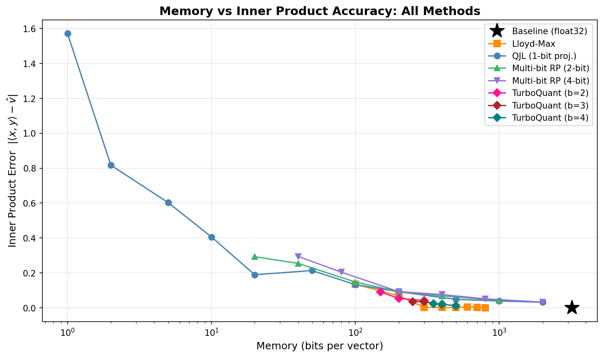

**グラフの開始位置が手法ごとに異なる理由：**

- **Lloyd-Max / TurboQuant** は元ベクトルの**全 $d$ 座標を量子化**するため、最低でも $d$ ビット（$d = 100$ なら $10^2$）が必要。グラフの左端に到達できない
- **QJL / Multi-bit RP** は**ランダム射影の結果だけを保存**するため、射影数 $m$ に依存し次元 $d$ に縛られない。$m = 1$ なら 1ビットから始まる

この開始位置の差自体が、座標ベースの手法と射影ベースの手法の根本的な違いを示している。

**主な発見：**

- **同じ100ビット予算**では、Lloyd-Max 1-bit と QJL m=100 は同程度の誤差
- **TurboQuant** は同じメモリ予算で他手法よりも低い内積誤差を達成
- **QJL** は次元 $d$ に縛られず射影数 $m$ で精度を任意に改善できる

### サマリテーブル

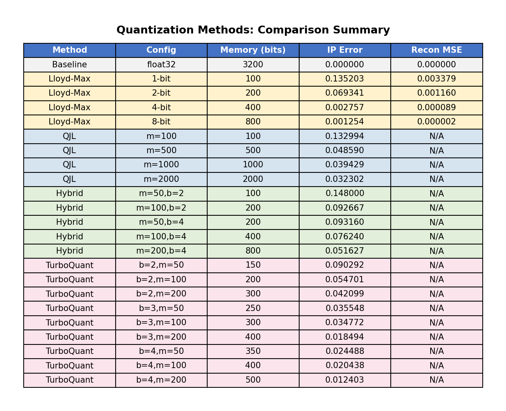

### QJL の収束

射影数 $m$ を増やすと推定値が真の内積に収束する（30回試行の平均 $\pm 1\sigma$）。

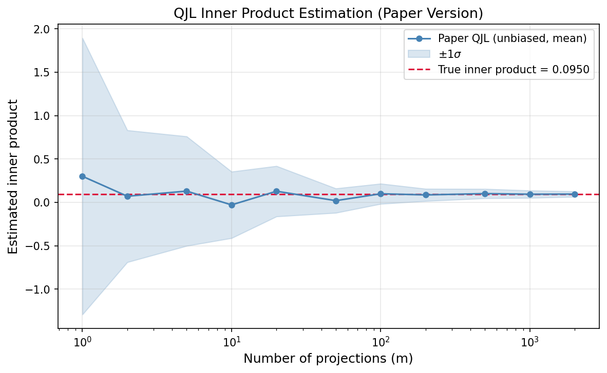

射影を1本ずつ追加していく過程：

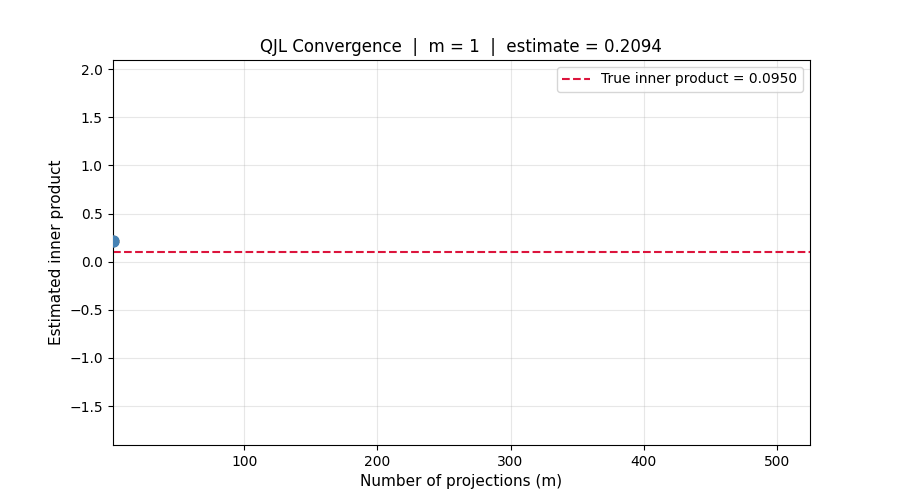

### 論文版 QJL vs 対称版 QJL

$\langle x, y \rangle = 0.5$ で比較。論文版（片側量子化）は厳密に不偏だが、対称版は $\pi/2 - \arccos(0.5) \approx 0.524$ にバイアスする。

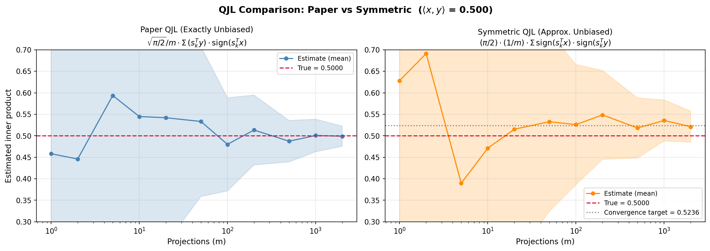

### ランダム回転の効果

偏ったベクトルの座標分布が、回転後に i.i.d. ガウス分布に変わる。これにより座標ごとの独立スカラー量子化が正当化される。

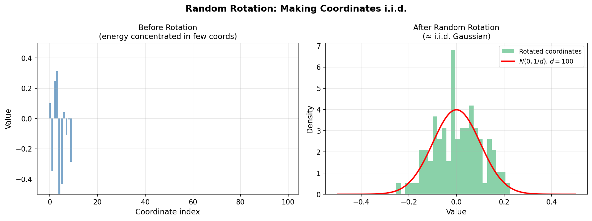

### TurboQuant の2段階アプローチ

MSE量子化のみ（バイアスあり）→ 残差 QJL で不偏推定に補正。

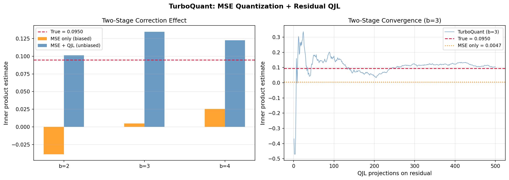

残差への QJL 射影を1本ずつ追加し、真の内積に収束していく過程：

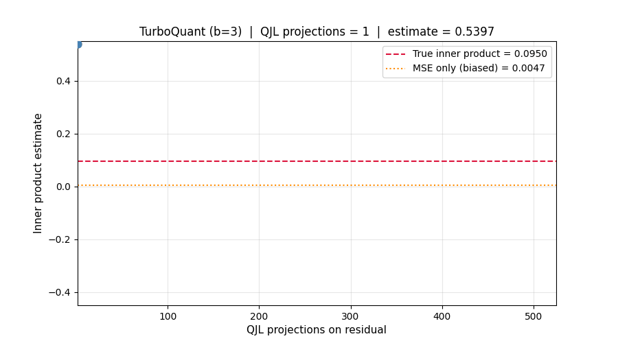

### Lloyd-Max 量子化器

標準正規分布に対する学習済み量子化器と MSE 収束。

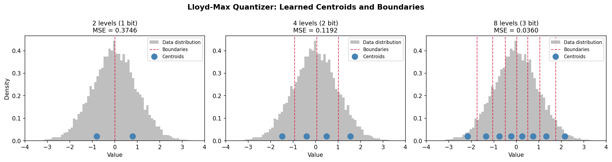

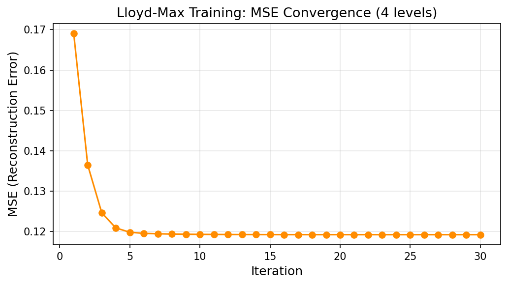

学習過程（境界とセントロイドが最適位置に移動）：

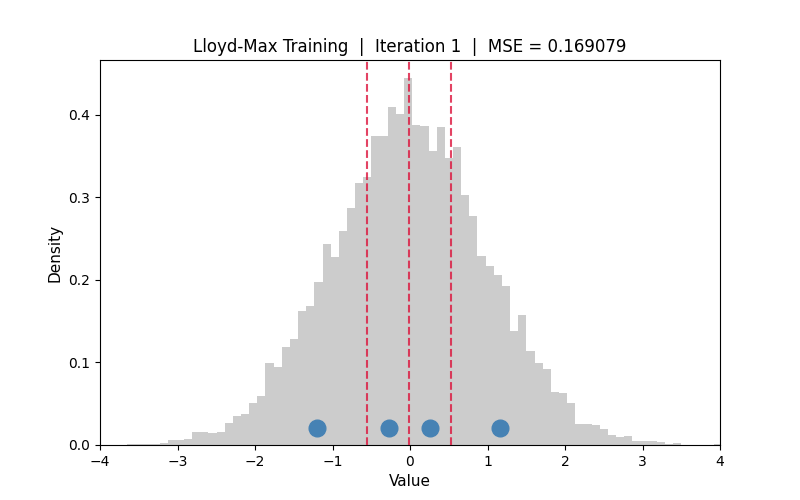

## 各手法のトレードオフ

| 観点 | Baseline | Lloyd-Max | QJL | Multi-bit RP | TurboQuant |
|------|----------|-----------|-----|-------------|------------|
| 内積精度 | 完全 | 低ビットでバイアス | 不偏、$m$で制御 | 中間 | 不偏、MSE+QJL |
| 再構成 | 完全 | MSE最小 | 不可 | 不可 | MSE部分は良好 |
| メモリ | $32d$ | $bd$ | $m$ | $mb$ | $(b{-}1)d + m$ |
| 計算コスト | 低 | 低（テーブル参照） | $O(md)$（射影） | $O(md)$（射影＋量子化） | $O(d \log d)$〜$O(d^2)$（回転）＋$O(md)$ |
| 用途 | 基準 | 重み圧縮 | 類似度検索 | バランス型 | KVキャッシュ圧縮 |

**TurboQuant について**: LLM の KV キャッシュ圧縮では、注意スコア（= 内積）を正確に近似する必要があります。MSE最適化で値を量子化すると再構成は良好ですが、低ビットで内積にバイアスが生じます。TurboQuant は MSE 量子化の再構成品質を維持しつつ、残差への QJL でバイアスを補正し、理論的に不偏な内積推定を実現します。

## ファイル構成

```
qjl_inner_product_estimation/
├── main.py                 # エントリーポイント
├── requirements.txt        # 依存ライブラリ
├── README.md               # このファイル
├── LICENSE
├── src/
│   ├── __init__.py
│   ├── utils.py            # ベクトル・サンプル生成、メモリ計算
│   ├── qjl.py              # QJL 内積推定（対称版＋論文版）
│   ├── lloyd_max.py        # Lloyd-Max 量子化器
│   ├── hybrid.py           # ハイブリッド手法（射影＋低ビット量子化）
│   ├── turbo_quant.py      # TurboQuant（ランダム回転＋MSE＋残差QJL）
│   ├── experiments.py      # 実験実行・データ収集
│   └── visualization.py    # グラフ・アニメーション生成
└── outputs/
    ├── figures/             # 静的グラフ（PNG）
    └── animations/          # アニメーション（GIF）
```

## 参考文献

- Zandieh, A., Han, I., Karbasi, A., & Mirrokni, V. (2025). *TurboQuant: Online Vector Quantization with Near-optimal Distortion Rate*. arXiv:2504.19874.
